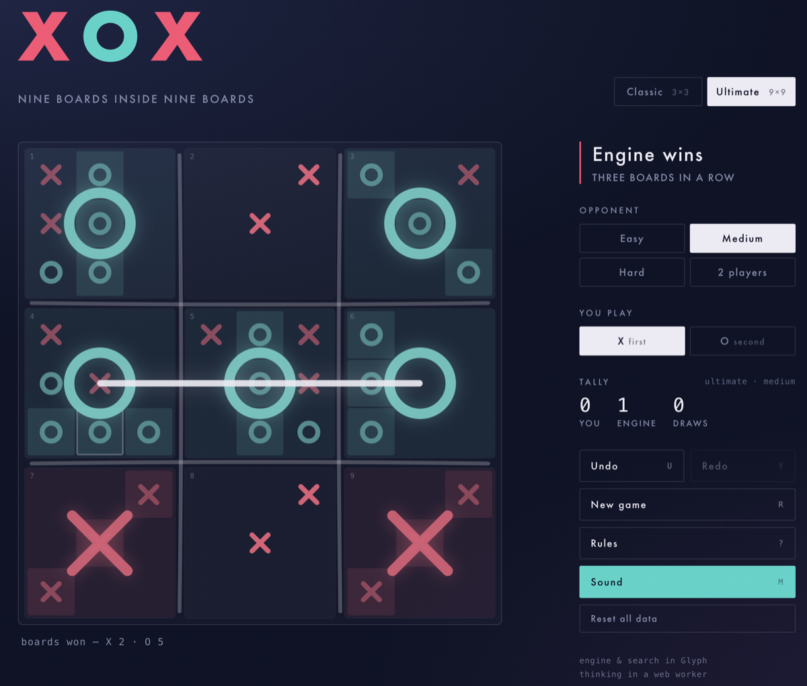

# XOX — Ultimate

Tic-tac-toe in [Glyph](https://www.npmjs.com/package/@glyphlang/glyph): a classic 3×3 mode and an
Ultimate 9×9 mode (nine boards inside nine boards), with an AI opponent that
thinks in a web worker. The engine and search are written in Glyph and compiled
to browser-loadable ES modules.



## Run

```sh
npm install
npm start
```

Then open <http://localhost:8787>.

The first `npm start` also compiles the Glyph engine to `assets/engine/`
(via `tools/build-web.mjs`); without that step the page loads but the board
stays empty because the browser modules 404. Later starts skip the build if
`assets/engine/` already exists.

## Rebuild the browser engine

After editing the engine source (`src/xox.glyph`, `src/ultimate.glyph`,
`src/ultimate_ai.glyph`), regenerate the browser modules:

```sh
npm run build:web
```

The server reads assets from disk on every request, so a reload in the
browser picks the new build up — no restart needed.

## CLI mode

The same engine also plays in the terminal:

```sh
npx glyph run . cli
```

Anything after `cli` is passed through to the CLI game.

## Layout

- `src/` — Glyph sources: game rules, AI search, web server, CLI
- `assets/` — the static web app (`index.html`, `app.js`, styles, worker)
- `assets/engine/` — generated browser build of the Glyph engine (gitignored)
- `tools/build-web.mjs` — Glyph → browser ES-module pipeline, with audit and smoke test
- `specs/` — specifications
